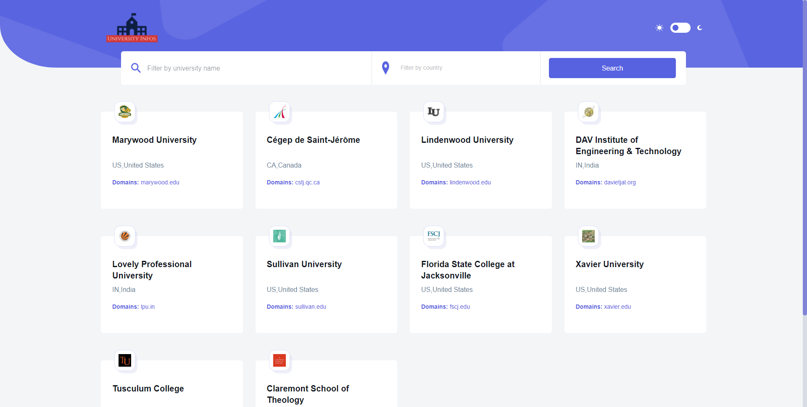

# PROJECT BTG challenge

## Requirements

For development, you will only need Node.js installed on your environement.

### Node

[Node](http://nodejs.org/) is really easy to install & now include [NPM](https://npmjs.org/).
You should be able to run the following command after the installation procedure
below.

    $ node --version
    v16.6.2

    $ npm --version
    7.20.3

## Install

    $ git clone https://github.com/BoyanLiuu/BTG-code-challenge.git
    $ cd BTG-code-challenge
    $ npm install

## Start & watch

    $ npm start

## Simple build for production

    $ npm run build

---

## Languages & tools

### HTML

### JavaScript

-   [React](http://facebook.github.io/react) is used for UI.

### CSS

-   [Styled Components](https://styled-components.com/) is used to style the app.
-   [Ant Design](https://ant.design/) is react UI library, I used Autocomplete , Pagination components

### Other package

-   [react-router-dom](https://reactrouter.com/web/guides/quick-start) is a standard library for routing in React
-   [react-loading-skeleton](https://www.npmjs.com/package/react-loading-skeleton) is used to make beautiful, animated loading skeletons in the app.

### Project Strucutre

    src
    ├── assets                  # Includes all the static asset files such as image,svg,icons
    ├── components              # Includes all the components of our App
    └── pages                   # Includes all the page we have for our App. Right now we only have one Home page
    │
    └── App.js                  # App entry point.

### Coding style:

1. Only using styled components to style our App.

    - Styled components allow us to create components that are extremely easy to reuse as they directly contain their style values.
    - It provide Scoped styles
    - It easy to create dynamic CSS

2. Name all the jsx file ending with file.jsx

3. Name file using camelcase convention

4. Only use function components

### Reflection:

The app consists of four components. They are SearchBar, SkeletonUniversityCard UniversityCard, Header. I put all the components in the components folder and organize them by the page they existed. If one component existed in all pages such as the header and footer I will put them directly under the components root folder. Each individual URL will have its own page which can be found in the pages folder. I wrote the app by implementing components by components way. My git commit history documents my working process. I used the card to display the information I got from API such as country, name, and domain name. I think this is the most reasonable, straightway to display information.

Besides just using the information we got from API, I did four additional things. First, I use [LOGO Api](https://clearbit.com/docs?shell#logo-api) to get the university icon from the website. Second, I added autocomplete ability for county input. It will make sure we would always input the correct country field. Third, I added dark/light mode just in case someone wants to read the page in the night. Fourth, I added the skeleton card component while we fetch the data. so users will understand how quickly the web will load even before the content has shown up

What I can do in the future.

1.  We can definitely create a backend and let users create an account and save their favorite school information.
2.  We can find a way to script either Wikipedia or university websites and get more information.
3.  We can also create a new page and visualize data in some pie chart or bar graph.
4.  We can also integrate with the world map. As the user clicks one area of the map, we would fetch corresponding data.
5.  The app right now is not compatible with all browsers, I used a CSS grid to display the card. However, the CSS card is not compatible with older browsers. It depends on our audience and decided whether we need to use another way to display the card.
6.  Improve lightbox score.
